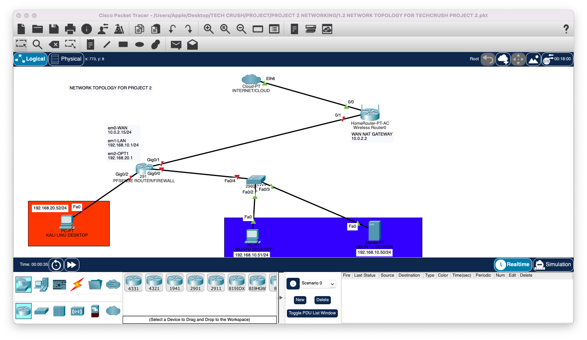
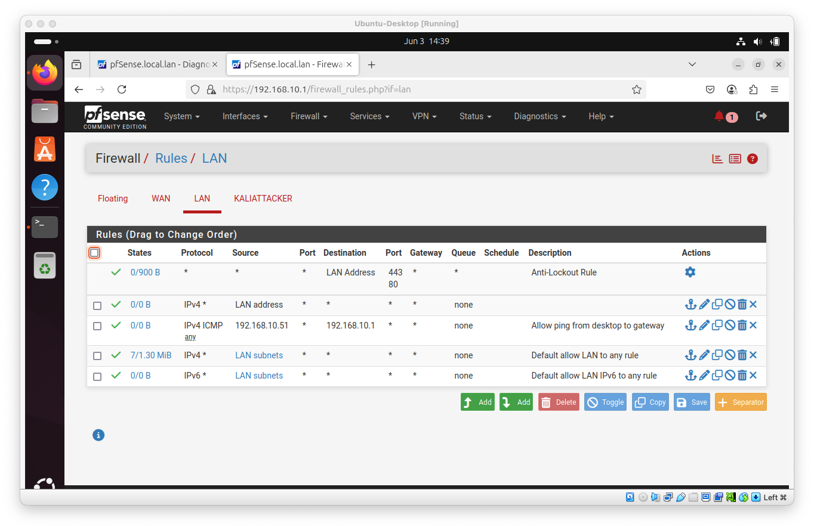
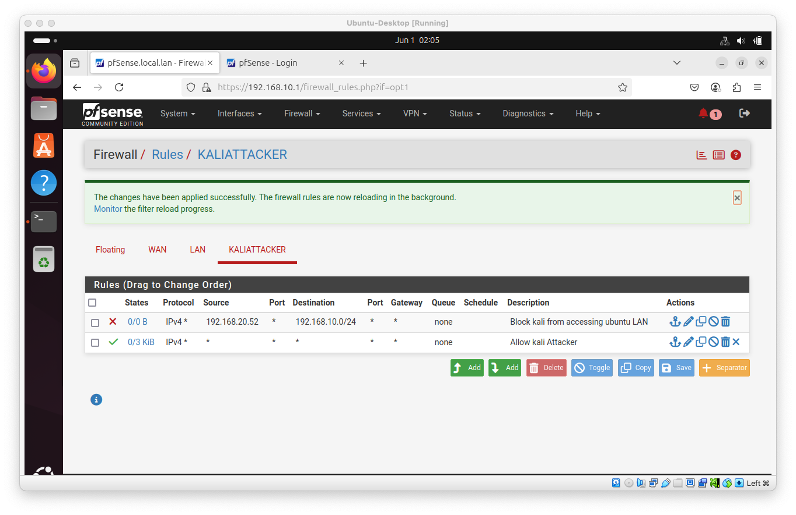
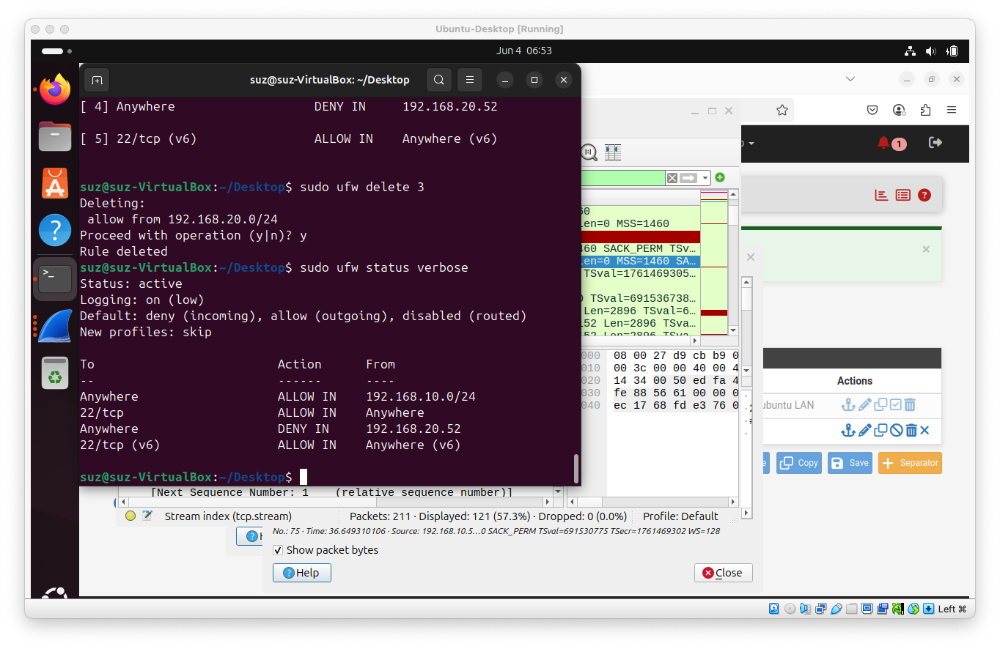
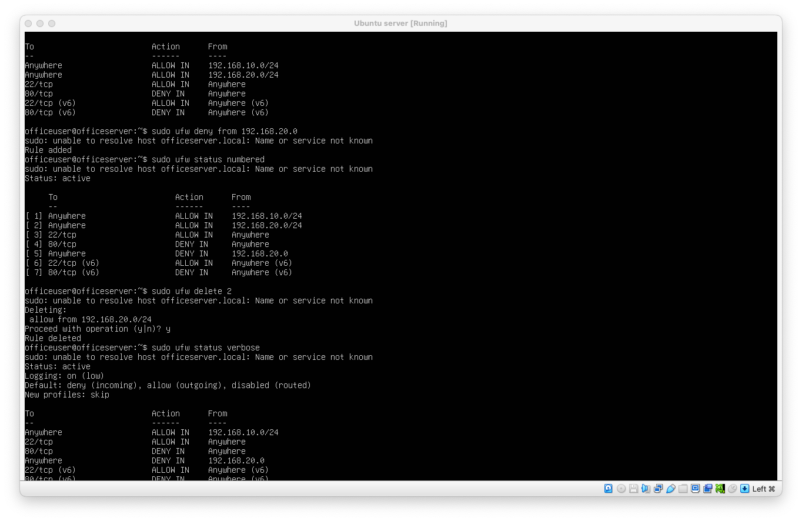
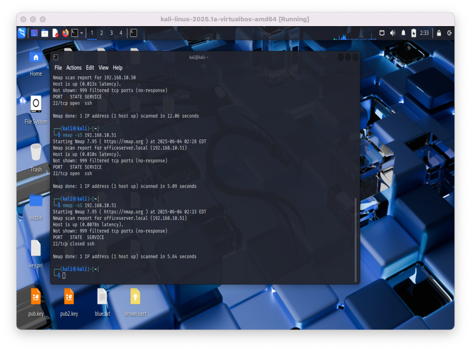
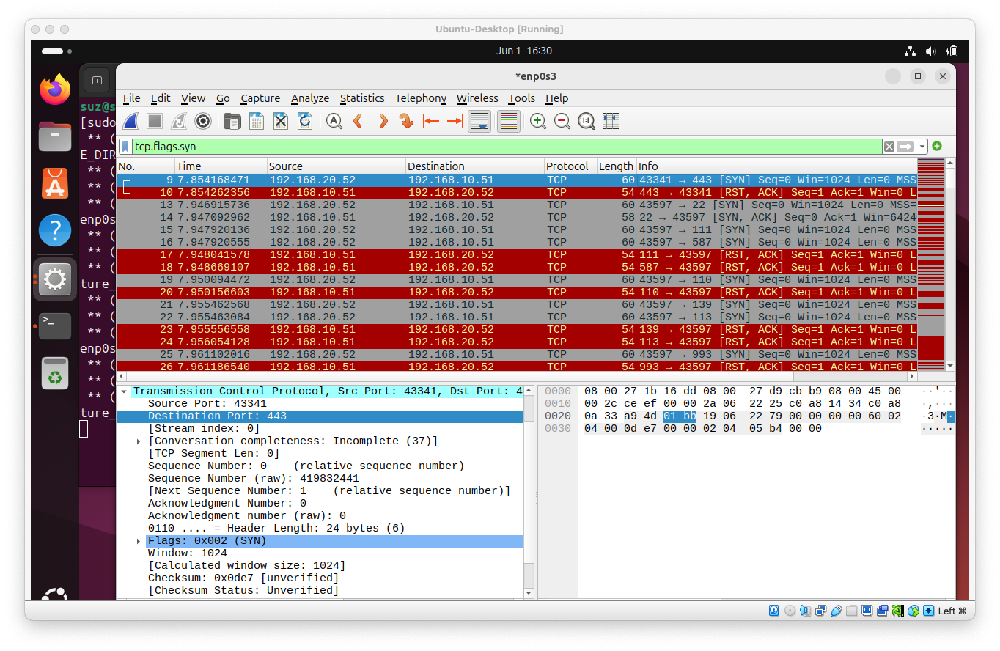
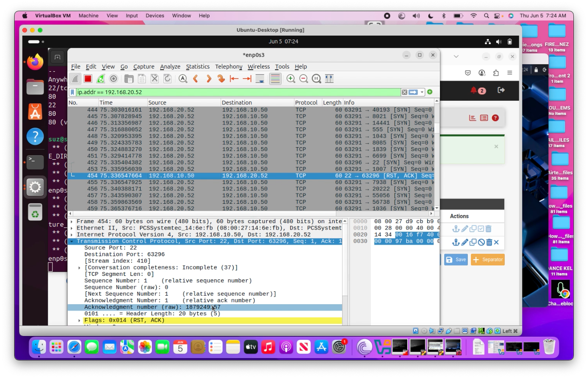
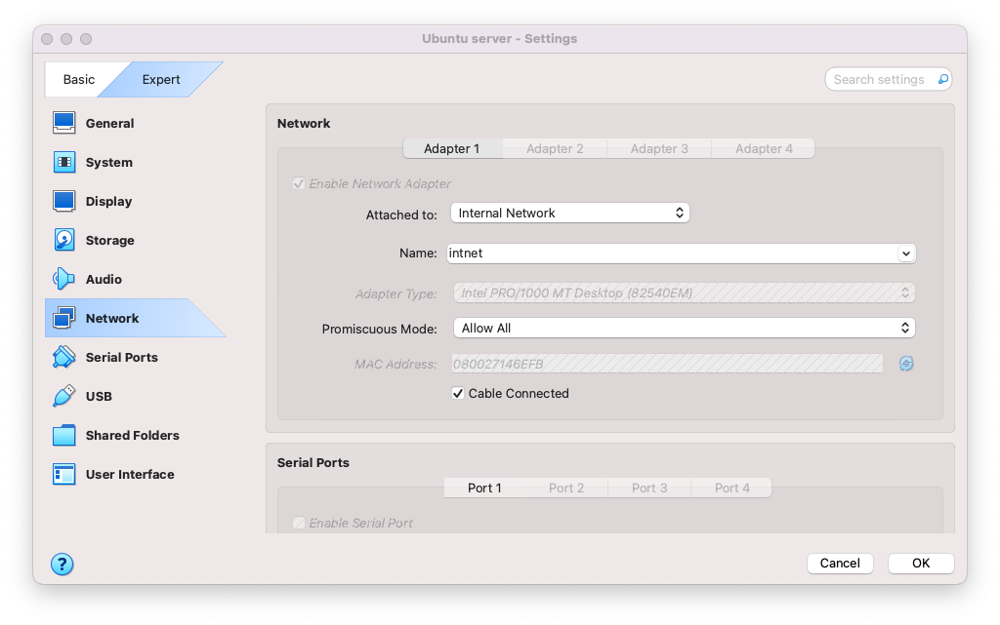

# techcrush-project-2-secure-small-network
Capstone Project 2 for TechCrush: Building a Secure Small Network with firewall rules, port scanning, and Wireshark analysis.
# 🛡️ TechCrush Project 2 – Building a Secure Small Network

## 📌 Table of Contents
- [Objective](#objective)
- [Project Overview](#project-overview)
- [Network Design](#network-design)
- [Tools & Technologies](#tools--technologies)
- [Implementation Steps](#implementation-steps)
- [Screenshots & Outputs](#screenshots--outputs)
- [Lessons Learned](#lessons-learned)
- [Future Improvements](#future-improvements)
- [Author](#author)

## 🎯 Objective

The objective of this capstone project is to design and implement a basic secure small network, demonstrating understanding of:
- Network security threats
- Implementation of firewall rules and access controls
- Verification using port scanning and packet capture tools

## 📖 Project Overview

In this project, I:
1. Designed a network topology with pfSense firewall/router, Ubuntu Desktop, Ubuntu Server, and Kali Linux attacker machine.
2. Implemented security controls to restrict unauthorized access within the network.
3. Verified security implementations using tools like Nmap and Wireshark.

## 🖥️ Network Design

### Network Components
- pfSense Firewall/Router
  - WAN: Bridged/NAT (Internet access)
  - LAN: Internal Network (LAN_Net)

- Ubuntu Desktop
  - IP: 192.168.10.51/24

- Ubuntu Server
  - IP: 192.168.10.50/24

- Kali Linux (Attacker)
  - IP: 192.168.20.52/24

### ![Network Diagram]

Figure 1. Network topology designed in Cisco Packet Tracer. This diagram illustrates the secure small network setup with pfSense firewall/router, Ubuntu Desktop, Ubuntu Server, and Kali Linux attacker machine, connected via VirtualBox internal networking to simulate real-world security testing.

## 🛠️ Tools & Technologies

- VirtualBox
- pfSense
- Ubuntu Desktop & Server
- Kali Linux
- Nmap
- UFW (Uncomplicated Firewall)
- Wireshark

## 🔧 Implementation Steps

### Step 1. Network Setup
- Installed pfSense, Ubuntu Desktop & Server, and Kali Linux on VirtualBox.
- Configured pfSense with proper WAN and LAN interfaces.
- Ensured all devices obtained correct IPs and could communicate through pfSense.

### Step 2. Firewall Rules Configuration
- Configured pfSense firewall rules to control traffic between the networks.
- Configured UFW on Ubuntu systems to allow only necessary ports and services.

### Step 3. Port Scanning & Hardening
- Used Nmap from Kali Linux to scan Ubuntu Desktop and Server.
- Identified open ports and disabled unnecessary services.
- Confirmed hardened state with subsequent scans.

### Step 4. Packet Capture & Analysis
- Used Wireshark to capture packets between Kali and Ubuntu systems.
- Verified if blocked rules worked by attempting connections and analysing dropped packets.

## 📸 Screenshots & Outputs

## 🔹 Network topology
  

Figure 1. Network topology diagram designed in Packet Tracer showing pfSense, Ubuntu Desktop, Ubuntu Server, and Kali Linux attacker. This diagram illustrates the secure small network setup with pfSense firewall/router, Ubuntu Desktop, Ubuntu Server, and Kali Linux attacker machine, connected via VirtualBox internal networking to simulate real-world security testing.

### 🔹 pfSense Firewall Rules

Figure 2a. Initial pfSense firewall rules configuration.

Figure 2b. Screenshot of configured pfSense firewall rules. Updated pfSense rules blocking Kali Linux from accessing Ubuntu systems. These rules were implemented to control inbound and outbound traffic between the LAN and WAN interfaces, ensuring only authorised connections are permitted.

### 🔹 UFW Status – Ubuntu Desktop

Figure 3. UFW status showing allowed and denied rules on Ubuntu Desktop. UFW (Uncomplicated Firewall) status on Ubuntu Desktop showing enabled rules to restrict incoming traffic, allowing only essential services to enhance host-based security.

### 🔹 UFW Status – Ubuntu Server

Figure 4. UFW status showing allowed and denied rules on Ubuntu Server. UFW status on Ubuntu Server displaying configured firewall rules. Unnecessary ports were blocked to reduce potential attack surfaces.

### 🔹 Nmap Scan Results – Before Hardening

Figure 5. Nmap scan results from Kali Linux before implementing firewall rules, showing open ports and after hardening, indicating reduced open ports and improved security posture. 

### 🔹 Wireshark Packet Capture

Figure 6. Wireshark capture verifying blocked and allowed traffic as configured in firewall rules. Wireshark capture analysing network packets between Kali Linux and Ubuntu systems. This verifies firewall effectiveness and confirms blocked or permitted traffic as configured.

### 🔹 VirtualBox Network Setup (Optional)

.png)
.png)
-(internal-network).png)

Figure 7. VirtualBox network settings showing NAT and internal network configuration for pfSense, Ubuntu, and Kali Linux VMs enabling realistic lab simulation for this project.

## 💡 Lessons Learned

- Practical setup of pfSense as a virtual firewall/router.
- Importance of layered security with both network-level and host-level firewalls.
- Effective use of Nmap for vulnerability scanning.
- Real-time packet capture and analysis with Wireshark.

## 🚀 Future Improvements

- Implement VLAN segmentation for better traffic isolation.
- Integrate IDS/IPS for intrusion detection.
- Automate firewall rule deployment using Ansible or scripts.
- Expand project with cloud-based firewall testing.

## 👤 Author

Onyinye Nwosu  
*Cybersecurity Student | TechCrush*  
July 2025

### 🔗 Connect with Me

- [LinkedIn](#) *(https://www.linkedin.com/in/onyinye-nwosu-techcrushscholar-4a23931ab/)*
- [Twitter/X](#) *(https://x.com/NwosuOnyinyeSP)*

---
> 📂 Note: This project was completed as part of the TechCrush Cybersecurity program to build practical hands-on skills in network security and system hardening.
